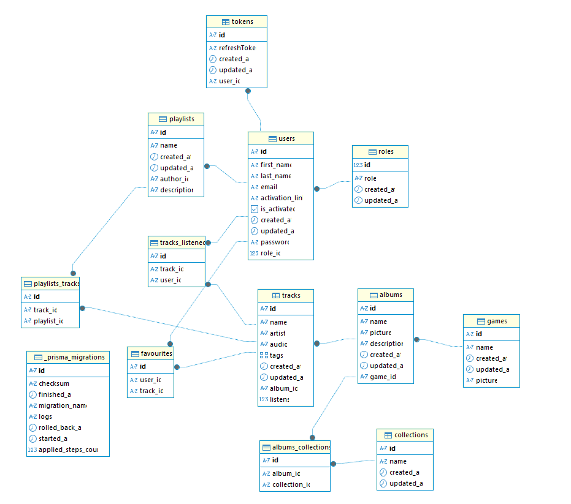
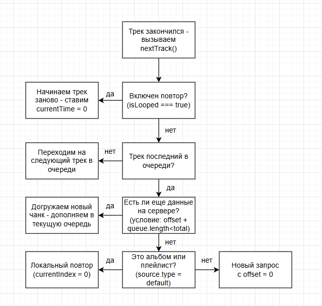
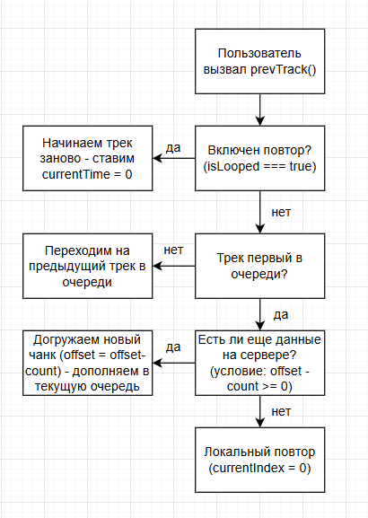
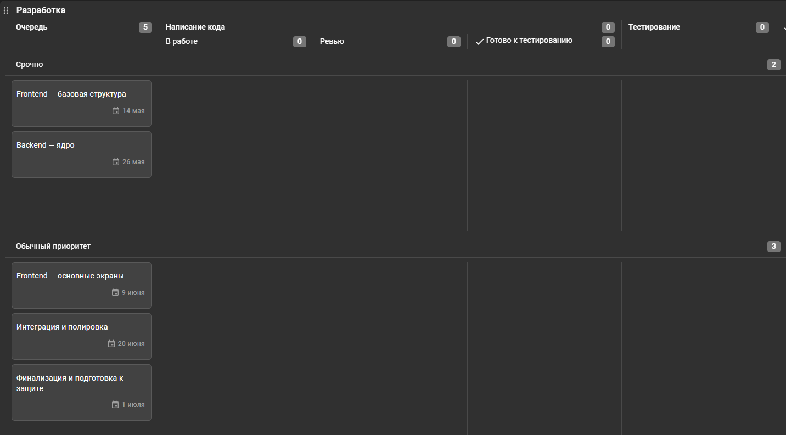

<div align="center">


# 🎵 Francis | Web Player

### Платформа для прослушивания OST'ов из игр

[](https://nextjs.org/)
[](https://react.dev/)
[](https://www.typescriptlang.org/)
[](https://fastify.dev/)
[](https://www.prisma.io/)
[](https://www.postgresql.org/)
[](https://www.docker.com/)
[](https://tailwindcss.com/)
[](https://zustand-demo.pmnd.rs/)
[](https://tanstack.com/query)
[](https://zod.dev/)
[](https://ant.design/)
[](https://jestjs.io/)
[](https://jwt.io/)
[](https://ollama.com/)
[](https://github.com/features/actions)
[](https://swagger.io/)
[](https://opensource.org/licenses/MIT)

</div>

<br />

## 💡 Идея

На данный момент существует огромное количество игр с потрясающими саундтреками, которые хочется слушать не только во время самой игры — по дороге домой, на прогулке в парке, или просто чтобы переслушать любимый трек ещё раз. Но доступ к такой музыке остаётся неожиданно неудобным: найти и скачать нужный OST — задача муторная, а качественный сервис, который решает эту проблему, конечно, можно, но (по личному опыту) не такая уж и простая задача.

**Francis** — это ответ на эту проблему. Платформа агрегирует саундтреки из игр в одном месте: с удобным поиском, плейлистами и структурой по играм, коллекциям и жанрам — без необходимости что-либо скачивать.

### 🎯 Целевая аудитория

| Роль | Кто это | Что хочет |
|---|---|---|
| 🎧 **Пользователь** | человек, который хочет прослушать музыку из какой-либо игры или серии игр | быстрый доступ к треку без лишних телодвижений |
| 🛡️ **Админ** | управляет контентом платформы | загружать музыку в новые или уже существующие подборки и следить за порядком на сайте |

<br />

## 📦 Стек технологий

| Слой | Технологии |
|---|---|
| 🎨 **Frontend** | React 19 · Next.js 16 · TypeScript · Zustand · TailwindCSS 4 · React Hook Form · Zod · TanStack Query · Ant Design · next-intl · Framer Motion · GSAP · Three.js |
| ⚙️ **Backend** | Node.js · Fastify 5 · Prisma ORM 7 · JWT · bcrypt · Nodemailer · Zod · Swagger |
| 🗄️ **База данных** | PostgreSQL 17 |
| 🐳 **Инфраструктура** | Docker · Docker Compose · GitHub Actions |
| 📖 **Документация API** | Swagger / OpenAPI |
| 🧪 **Тесты** | Jest · React Testing Library · Supertest |
| 🤖 **ИИ-модель** | Ollama (llama3) |
| 🌍 **Локализация** | next-intl · 🇷🇺 русский · 🇬🇧 английский · 🇫🇷 французский |

<br />

## 👤 User Stories

- 🎧 Как **пользователь**, я хочу быстро найти конкретный OST и прослушать его.
- 🎮 Как **пользователь**, я хочу прослушать всю музыку (OST'ы) из моей любимой игры.
- 🎼 Как **пользователь**, я хочу послушать OST'ы из игр, которые по жанру близки к тому, что мне нравится.
- 🛡️ Как **админ**, я хочу управлять состоянием загруженного OST'а.
- 🛡️ Как **админ**, я хочу видеть все загруженные на платформу OST'ы.

<br />

## 🗃 ER-диаграмма

<div align="center">



</div>

<br />

## ✨ Функциональность

## ✨ Функциональность

| Функция | Статус | Описание |
|---|:---:|---|
| 📧 Email-подтверждение | ✅ готово | подтверждение создания профиля через ссылку в письме |
| 🔐 JWT-авторизация | ✅ готово | вход/регистрация с access-токенами, разграничение ролей (гость/пользователь/админ) |
| 🎶 Плейлисты | ✅ готово | пользователь сам составляет плейлисты из понравившихся треков |
| ❤️ Лайки / избранное | ✅ готово | отметка треков как избранных, отдельный раздел в ЛК |
| 🕓 История прослушиваний | ✅ готово | автоматический учёт прослушанных треков, отдельная вкладка в профиле |
| 🔍 Поиск с пагинацией | ✅ готово | поиск по трекам, альбомам, коллекциям и играм с постраничной подгрузкой |
| ▶️ Плеер с очередью | ✅ готово | последовательное/обратное воспроизведение, дозагрузка треков по мере прослушивания, зацикливание |
| 🗂️ Каталог контента | ✅ готово | структура треков по играм, альбомам и тематическим коллекциям |
| 🛡️ Админ-панель | ✅ готово | создание/редактирование/удаление треков, альбомов, коллекций и игр |
| ✍️ Автозаполнение описаний | ✅ готово | автогенерация description для админа при создании/редактировании контента и пользователя при работе с плейлистами (Ollama) |
| 🌍 Мультиязычность | ✅ готово | интерфейс доступен на русском, английском и французском (next-intl, роутинг через `[locale]`) |
| 📚 Документация API | ✅ готово | автогенерируемая Swagger/OpenAPI-документация всех эндпоинтов |
| 🔄 CI/CD | ✅ готово | автоматическая линтовка, тайпчек, тесты и сборка на каждый push/PR |

<br />

## 🗺 Страницы приложения

Роутинг построен на **route groups** Next.js App Router — `[locale]` оборачивает всё приложение и переключает язык (🇷🇺 / 🇬🇧 / 🇫🇷), а вложенные группы `(default)`, `(auth)`, `(protected)`, `(admin)` разделяют доступ без изменения URL.

```
🌍 [locale]                        ru / en / fr — переключение языка

📖 (default) — публичные страницы
├── 🏠 about                        о проекте / команде
├── 🎵 tracks                       список треков с поиском и пагинацией
├── 💿 albums                       список альбомов с поиском
├── 📂 collections                  список коллекций с поиском
├── 🎮 games                        список игр с поиском
├── 👥 team                         страница команды
└── 🤝 contribution                 заявка стать автором / предложить контент

🔑 (auth)
└── auth                            авторизация / регистрация

🔒 (protected) — только для авторизованных
├── 👤 profile                      личный кабинет пользователя + edit
└── 🎶 playlists                    список, [id], create, edit/[id]

🛡️ (admin) — только для админа
└── content
    ├── tracks         create · edit · remove
    ├── albums         create · edit · remove · addToCollection · removeFromCollection
    ├── collections     create · edit · remove
    └── games            create · edit · remove
```

**Особенности навигации:**
- после авторизации пользователь остаётся на текущей странице
- после регистрации админа сразу перебрасывает в `/admin`

<br />

## 🔐 Роли и права доступа

<table>
<tr>
<td valign="top" width="33%">

**🌐 Гость**
- ▶️ Проигрывание треков
- 🔍 Поиск по альбомам
- 🔍 Поиск по коллекциям

</td>
<td valign="top" width="33%">

**👤 Пользователь**

*Всё, что доступно гостю, плюс:*
- 🙋 Страница профиля
- ❤️ Лайки
- 🎶 Составление плейлистов
- ➕ Добавление трека в плейлист
- 📂 Раздел с плейлистами в ЛК
- 🎯 Рекомендации *(план)*

</td>
<td valign="top" width="33%">

**🛡️ Админ**

*Всё, что доступно пользователю, плюс:*
- 🖥️ Админ-интерфейс
- ✅ Создание/удаление альбомов
- ✅ Создание/удаление треков
- ✅ Создание/удаление/редактирование каталогов

</td>
</tr>
</table>

<br />

## 📁 Структура проекта

### Монорепозиторий

```
francis/
├── 🎨 frontend/          Next.js приложение
├── ⚙️ backend/            Fastify API + Prisma
├── 🖼️ misc/               изображения и диаграммы для документации
└── 🔄 .github/workflows/  CI-пайплайны
```

### Frontend — `app/`

```
app/
├── [locale]/                       ru / en / fr — локализация через next-intl
│   ├── (admin)/
│   │   ├── content/
│   │   │   ├── albums/             create, edit, remove, addToCollection, removeFromCollection
│   │   │   ├── collections/        create, edit, remove
│   │   │   ├── games/              create, edit, remove
│   │   │   └── tracks/             create, edit, remove
│   │   ├── layout.tsx
│   │   └── page.tsx
│   ├── (auth)/
│   │   └── auth/
│   │       └── page.tsx
│   ├── (default)/
│   │   ├── about/
│   │   ├── albums/
│   │   ├── collections/
│   │   ├── contribution/
│   │   ├── games/
│   │   ├── team/
│   │   ├── tracks/
│   │   ├── layout.tsx
│   │   └── page.tsx
│   └── (protected)/
│       ├── playlists/
│       │   ├── [id]/
│       │   ├── create/
│       │   ├── edit/[id]/
│       │   │   └── page.tsx
│       │   └── page.tsx
│       ├── profile/
│       │   ├── edit/
│       │   └── page.tsx
│       └── layout.tsx
├── globals.css
├── layout.tsx
└── favicon.ico
```

> Группы в круглых скобках `(admin)`, `(auth)`, `(default)`, `(protected)` — это [route groups](https://nextjs.org/docs/app/building-your-application/routing/route-groups) Next.js: разделяют доступ и layout'ы, но не влияют на итоговый URL.

<br />

## 🚀 Быстрый старт

### Предварительные требования

- ✅ Node.js ≥ 20.x (⚠️ при запуске тестов на Frontend необходимо иметь версию Node.js >= 24.18 и выше)
- ✅ PostgreSQL 17 (через Docker)
- ✅ npm

### Как собрать легко собрать приложение?

### 1️⃣ Клонирование репозитория

```bash
git clone https://github.com/gierszal/francis.git
cd francis
```

### 2️⃣ Переходим в корень проекта

```bash
cd backend
```

1) Создаем `.env` в `/` (см. /.env.example), 
2) Создаем `.env` в `/backend` (см. /backend/.env.example),
3) Создаем `.env.local` в `/frontend/env.local` (см. /frontend/.env.example),

### 3️⃣ Теперь в корне проекта ...

1) Пишем: docker compose up -d --build
2) После завершения пишем в консоли docker exec -it backend (название контейнера): docker exec -it backend npm run db:seed

Все!

🎉 Приложение будет доступно на `http://localhost:3000` (ну или порт, который был указан вами в конфигурации, по дэфолту это 3000).

### ⚠️Если не указать параметры SMTP, то аутентификация будет недоступна, но остальной функционал, с ней не связанный, будет работать) 

<br />

## ⚙️ Переменные окружения


### ⚠️ Корень проекта (при использовании docker compose) — `/.env` -> Оформляем по env.example

### Backend — `backend/.env` -> Оформляем по env.example

### Frontend — `frontend/.env.local` -> Оформляем по env.local.example


<br />

## 📜 Скрипты

### Backend

| Команда | Назначение |
|---|---|
| `npm run dev` | ▶️ запуск в dev-режиме (`tsx watch`) |
| `npm run build` | 🔨 компиляция TypeScript |
| `npm start` | 🚀 сборка + запуск production-версии |
| `npm run prisma:generate` | 🔧 генерация Prisma Client |
| `npm run db:push` | 📤 применение схемы к БД без миграций |
| `npm run db:migrate up` | 🔄 сброс и применение миграций |
| `npm run db:seed` | 🌱 заполнение БД тестовыми данными |
| `npm run test` | 🧪 запуск тестов (Jest) |
| `npm run type:check` | 🔎 проверка типов |
| `npm run lint:check` / `lint:write` | 🎨 проверка / автоформатирование (Prettier) |

### Frontend

| Команда | Назначение |
|---|---|
| `npm run dev` | ▶️ запуск в dev-режиме |
| `npm run build` | 🔨 production-сборка |
| `npm start` | 🚀 запуск собранного приложения |
| `npm run test` | 🧪 запуск тестов (Jest + RTL) |
| `npm run type:check` | 🔎 проверка типов |
| `npm run lint:check` / `lint:write` | 🎨 проверка / автоформатирование (Prettier) |

<br />

## 🧪 Тестирование и качество кода

```bash
# Backend
cd backend && npm run test

# Frontend
cd frontend && npm run test
```

```bash
npm run lint:check    # 🎨 Prettier — проверка форматирования
npm run type:check    # 🔎 TypeScript — проверка типов
```

<br />

## 🔄 CI/CD

Проект использует **GitHub Actions** для автоматической проверки на каждый push/PR в `main`/`dev`:

1. 📦 установка зависимостей (backend + frontend)
2. 🎨 проверка форматирования (Prettier)
3. 🔎 проверка типов (TypeScript)
4. 🧪 тесты (Jest)
5. 🔨 сборка (build)

Пайплайн прогоняется по матрице **ОС** (Ubuntu, Windows) и **версий Node.js** — для уверенности, что всё работает одинаково стабильно везде.

<br />

## ⏳ Логика очереди треков

### Логика при последовательном проигрывании


### Логика при проигрывании в обратном направлении


<br />

## 📚 API-документация

После запуска backend'а Swagger UI доступен по адресу:

```
(если запускаете локально)
http://localhost:5000/docs
```

*(также надо смотреть на порт, по дэфолту - 5000)*

<br />

## 🗺 План действий

<div align="center">



</div>

📋 Доска задач: [giersz.kaiten.ru](https://giersz.kaiten.ru/space/780759/boards)

<br />

---

<div align="center">

### 🎧 Francis — музыка без границ

**Лицензия MIT** — делай с кодом что хочешь, только оставь копирайт 😉

</div>